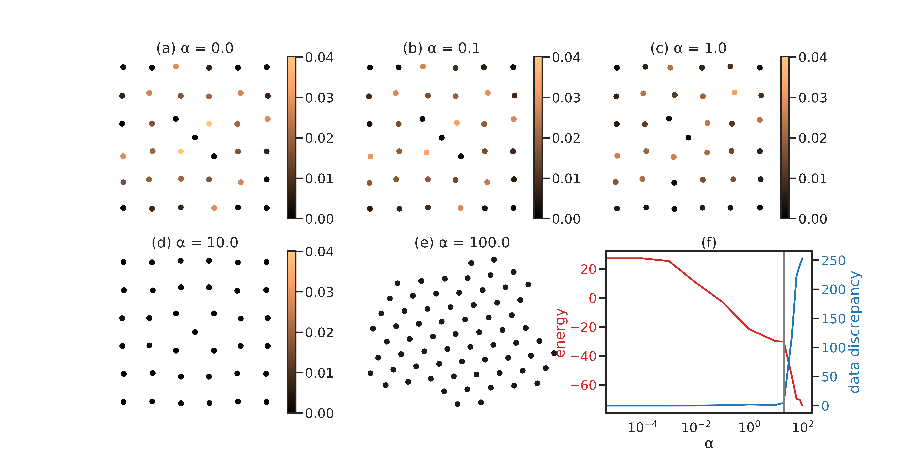

```{r setup, include=FALSE}
knitr::opts_chunk$set(echo = FALSE)
```

# Introduction

Electron tomography is a technique for resolving the interior of nanomaterials from a series of projection images. __Discrete tomography__ approaches have been shown to reconstruct nanocrystals of increasing complexity. A key limitation of these methods is that they assume atoms to lie on a coarse spatial grid whereas, in practice, __lattice defects__ in nanocrystals cause atoms to deviate from regular positions.

We present two alternative __grid-free__ reconstruction approaches: 1) a super-resolution approach that allows for continuous deviations of atom locations, and 2) a __deep learning__ approach to identify atom locations from blurred reconstructions

# Summary of Main Results

1. Allowing for continuous deviations of atom locations __aids reconstruction__ of test lattices with data from __very few tilt angles__ (2 or 3).

2. Incorporating a physical model for the __potential energy of the atomic configuration__ corrects for __poor initialisations__.

3. __Learned post processing__ from reconstructed images performs poorly for limited data.

# Mathematical Formulation

An atomic configuration is characterised by a positive measure $\mu$ on a bounded subset $X$ of $\mathbb{R}^d$, which represents the electron density. The Radon transform of the measure, $\mathcal{R} \mu$, provides a simplified mathematical model of the image formation process. The corresponding inverse problem is to recover $\mu$ from noisy observations given by $y = \mathcal{R} \mu + \varepsilon$.

We consider atomic configurations to be __sparse measures__ of the form: $\mu = \sum_{i=1}^n w_i (G \ast \delta_{\boldsymbol{x}_i})$, where $G$ denotes a Gaussian that quantifies thermal motion of atoms and the weights $w_i$ are used to differentiate between atom types. 

To recover $\mu$, we model interatomic interactions explicitly by the __Lennard-Jones__ pair potential and solve the following optimisation problem:
$$
\begin{aligned}
    & \underset{\boldsymbol{x}\in \mathcal{C}, w \in \{0,1\}^n}{\text{minimise}}
    & & \Big \| \sum_{i=1}^n w_i \psi(\boldsymbol{x}_i) - y \Big \|^2_2 + \alpha V_{\text{tot}}(\vec{x}), \\
    \end{aligned}
$$
where $V_{\text{tot}}$ is the total potential energy and $\alpha$ is a regularisation parameter.

# Results


We used a modified version of the __alternating descent conditional gradient (ADCG)__ [@boyd2017alternating] algorithm to obtain atom locations. At each iteration, the algorithm 1) __adds a new atom__ on a coarse grid and 2) __locally moves__ all atoms. An animated reconstruction run is shown on the right.

### Comparison of reconstructions

<small>Reconstructions of common lattice defects from 2 projections.  For simulated annealing, ADCG ($\alpha=0$) and ADCG with energy ($\alpha>0$) reconstructions, atoms are coloured according to their Euclidean distance from the ground truth. The ground truth positions  are  marked  with  red  crosses.</small>

### Effect of adding energy

<small>Tuning $\alpha$ amounts to moving from data-optimal to energy-optimal configurations. Increasing $\alpha$ beyond an optimal value (grey line in plot) leads to a large increase in the data discrepancy due to addition of more atoms.</small>

# Learned Post-processing


We trained a deep neural network [@boyd2018deeploco] to identify atom locations from blurred SIRT reconstructions.  
This approach although more scalable than ADCG did not perform well for cases where data from only very few angles were available. SIRT reconstructions with identified atoms (red crosses) are shown on the left.

# Outlook

* Incorporate appropriate features of global optimisation into ADCG

* Use more realistic potential energy models

* Explore deep learning based iterative schemes

# Acknowledgements
<small>This project received funding from the EU's Horizon 2020 research and innovation programme under the Marie Sklodowska-Curie grant agreement no. 765604.</small>

# References

